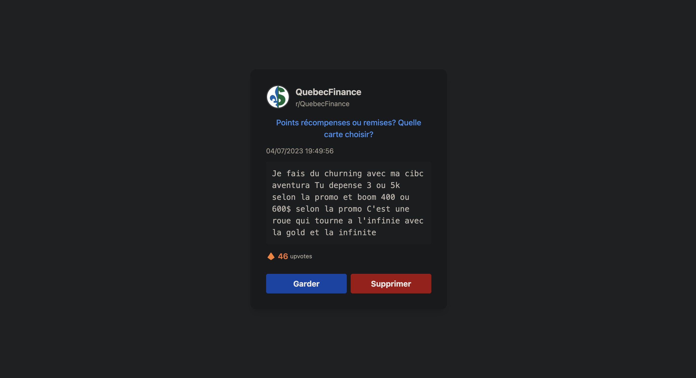

# Gestionnaire de commentaires Reddit



Une application web permettant de gérer et nettoyer facilement vos commentaires Reddit.

## 📝 Description

Reddit Cleaner est une application web qui vous permet de consulter et de gérer vos commentaires Reddit de manière efficace et intuitive. L'application affiche vos commentaires dans l'ordre chronologique (du plus ancien au plus récent) et vous permet de les supprimer ou de les conserver.

### Fonctionnalités

- 📋 Affichage chronologique des commentaires (du plus ancien au plus récent)
- 🖼️ Affichage du thumbnail et du titre du subreddit
- 📌 Titre du post cliquable (ouvre le post original dans un nouvel onglet)
- ⏰ Date du commentaire
- 👍 Nombre d'upvotes
- 🗑️ Suppression facile des commentaires

## 🛠️ Technologies utilisées

- **Backend**: Python, Flask, PRAW (Reddit API Wrapper)
- **Frontend**: HTML, CSS (Tailwind CSS), JavaScript
- **Conteneurisation**: Docker, Docker Compose

## 📋 Prérequis

- Docker et Docker Compose
- Compte Reddit et accès à l'API Reddit (client_id, client_secret, etc.)
  - [Guide pour créer une application Reddit API](https://github.com/reddit-archive/reddit/wiki/OAuth2) ou consultez notre section "Configuration des variables d'environnement" ci-dessous

## 🚀 Démarrage

### Configs

Créez un fichier `.env` à la racine du projet avec le contenu suivant :

```env
REDDIT_CLIENT_ID=votre_client_id
REDDIT_CLIENT_SECRET=votre_client_secret
REDDIT_USERNAME=votre_nom_utilisateur_reddit
REDDIT_PASSWORD=votre_mot_de_passe_reddit
REDDIT_USER_AGENT=script:reddit-cleaner:v1.0 (by /u/votre_nom_utilisateur)
```

> **Note**: Pour obtenir `client_id` et `client_secret`, vous devez [créer une application sur Reddit](https://www.reddit.com/prefs/apps/) en suivant ces étapes:
> 1. Connectez-vous à votre compte Reddit
> 2. Accédez à "Preferences" > "Apps"
> 3. Sélectionnez "Create App" ou "Create Another App"
> 4. Remplissez les informations requises (nom, description, etc.)
> 5. Sélectionnez "script" comme type d'application

### Docker

Lancer l'application avec Docker Compose

```bash
docker compose up --build
```

L'application sera accessible à l'adresse [http://localhost:5002](http://localhost:5002)
